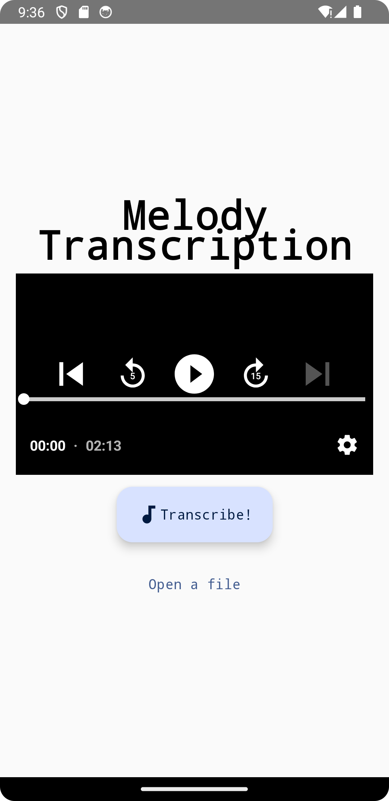
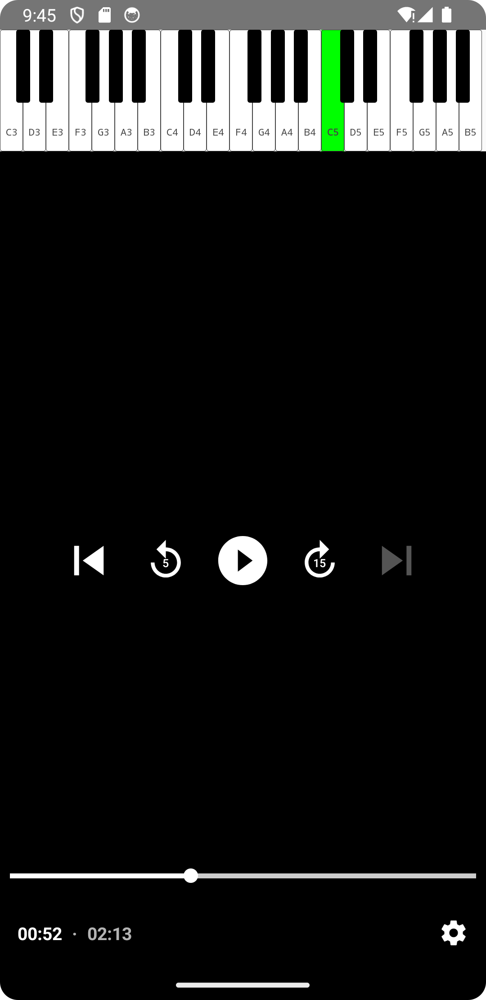

# Melody Transcription
Android app that allows to extract the vocal melody from a song, transcribe it and visualize on a piano keyboard
- choose an audiofile (mp3, mp4, m4a, wav, flac, ogg supported)
- tap `Transcribe!`
- follow the transcribed melody notes with playback

  
